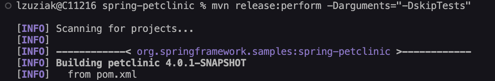
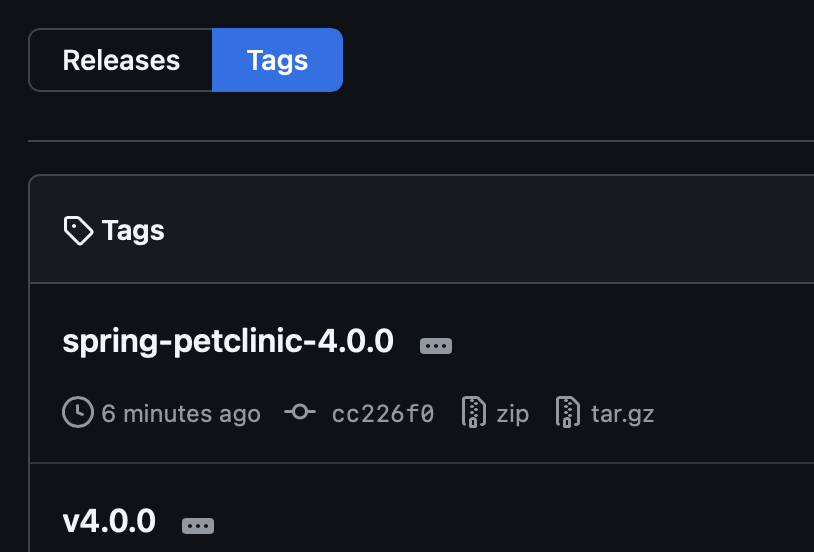
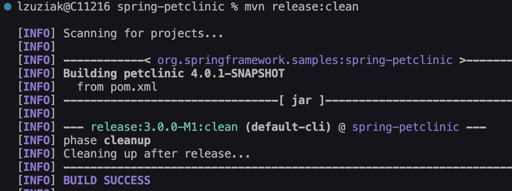

# Practical Task Report: Spring Petclinic Maven Release

## 1. Install Java and Maven 
- **Commands used**:
```bash
brew install openjdk
brew install maven
```
- **Result**:  


---

## 2. Clone Spring Petclinic Repository
- **Command used**:
```bash
git clone https://github.com/liliia-zuziak/spring-petclinic
cd spring-petclinic
```
- **Result**:  


---

## 3. Validate Project with Maven
- **Command used**:
```bash
mvn validate
```
- **Result**:  


---

## 4. Package JAR and Run the Application
- **Commands used**:
```bash
mvn package
java -jar target/*.jar
```
- **Result**:  
Application built and launched successfully.


---

## 5. Update Project Version to 4.0.0
- **Manual update**:
```xml
<version>4.0.0-SNAPSHOT</version>
```
- **Result**:  
Version updated in `pom.xml`.


---

## 6. Add SCM Section and Release Plugin


---

## 7. Prepare Release
- **Command used**:
```bash
mvn release:clean release:prepare -Darguments="-DskipTests" -B
```
- **Result**:  
Release preparation completed successfully.


---

## 8. Perform the Release
- **Command used**:
```bash
mvn release:perform -Darguments="-DskipTests"
```
- **Result**:  
Artifacts released successfully. New version initialized.



---

## 9. Perform Release Cleanup
- **Command used**:
```bash
mvn release:clean
```
- **Result**:  
Cleanup after release completed successfully.

